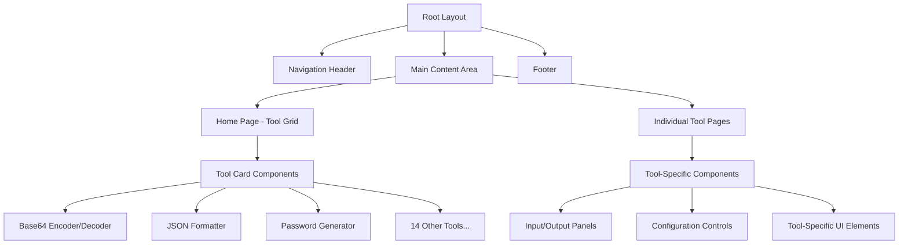

# Dev Tools - Complete Project Specification

## 1. Product Requirements Overview

### Executive Summary
Dev Tools is a comprehensive web-based developer utility application that consolidates 17 essential development tools into a single, intuitive platform. Built with Next.js 15, the application provides developers with quick access to encoding/decoding, formatting, conversion, and generation utilities without requiring multiple external services.

### Business Objectives
- **Consolidation**: Reduce dependency on multiple external tools and websites
- **Performance**: Provide fast, client-side processing for developer tasks  
- **User Experience**: Deliver an intuitive, responsive interface optimized for developer workflows
- **Accessibility**: Ensure tools are available offline and work across all devices

### Product Vision
"To create the ultimate developer toolkit that eliminates the need to search for and bookmark multiple utility websites, providing all essential development tools in one seamless, fast, and reliable application."

**Target Users**: Full-stack developers, frontend specialists, backend engineers, DevOps engineers, and technical professionals requiring quick access to encoding/decoding, formatting, and conversion utilities.

**Core Value**: Centralized hub for essential developer tools with optimized performance, offline capability, and intuitive user experience.

### Success Metrics
- **Adoption Rate**: Target 1000+ active users within first quarter
- **Tool Usage**: Average 5+ tools used per session
- **Performance**: < 2 second load time for any tool
- **User Satisfaction**: 4.5+ star rating on developer feedback

## 2. User Stories & Functional Requirements

### Epic 1: Core Application Foundation
**As a developer, I want a centralized hub for development tools so that I don't need to bookmark multiple websites.**

#### User Stories:
- As a user, I want to see all available tools in a 5x5 grid layout so I can quickly identify what I need
- As a user, I want to search for tools by name or functionality so I can find them quickly
- As a user, I want to access recently used tools so I can return to frequent tasks efficiently
- As a user, I want the application to work offline so I can use tools without internet connectivity

### Epic 2: Text Processing & Encoding Tools
**As a developer, I want reliable text encoding and formatting tools so I can process data quickly.**

#### User Stories:
- As a user, I want to encode/decode Base64 text so I can handle API data transformations
- As a user, I want to encode/decode URLs so I can work with web parameters safely
- As a user, I want to format JSON so I can read and debug API responses
- As a user, I want to format SQL so I can make database queries readable
- As a user, I want to encode/decode JWTs so I can debug authentication tokens

### Epic 3: Data Conversion & Generation Tools
**As a developer, I want conversion and generation utilities so I can transform data between formats.**

#### User Stories:
- As a user, I want to convert JSON to YAML so I can work with different configuration formats
- As a user, I want to generate TypeScript types from JSON so I can create type-safe code
- As a user, I want to convert timestamps so I can work with different time formats
- As a user, I want to generate secure passwords so I can create strong credentials
- As a user, I want to generate UUIDs so I can create unique identifiers
- As a user, I want to generate hashes so I can verify data integrity

### Epic 4: File Processing Tools
**As a developer, I want file processing capabilities so I can manipulate media and documents.**

#### User Stories:
- As a user, I want to encode/decode images to Base64 so I can embed them in code
- As a user, I want to convert image formats so I can optimize for different use cases
- As a user, I want to compress images so I can reduce file sizes for web deployment
- As a user, I want to preview Markdown so I can see how documentation will render

### Epic 5: Advanced Utilities
**As a developer, I want specialized tools for complex tasks so I can handle advanced scenarios.**

#### User Stories:
- As a user, I want to test regular expressions so I can validate pattern matching
- As a user, I want to parse CRON expressions so I can understand scheduled tasks

## 3. Technology Stack & Dependencies
- **Next.js 15.5.2** with App Router architecture
- **React 19.1.0** for component-based UI
- **TypeScript 5** for type safety and enhanced developer experience

### Styling & UI Components
- **Tailwind CSS 4** for utility-first styling approach
- **Mantine UI** for pre-built, accessible components
- **PostCSS** for CSS processing and optimization

### Additional Dependencies
- **Geist fonts** (Sans & Mono) for optimized typography
- **ESLint** with Next.js configuration for code quality

### Build & Development Tools
- **Turbopack** for accelerated development and build processes
- **TypeScript compiler** for static type checking

## 4. Component Architecture

### Application Structure


### Component Hierarchy

#### Core Layout Components
- **RootLayout** (`app/layout.tsx`)
  - Global styles and font configuration
  - Metadata management
  - Theme provider wrapper
  
- **NavigationHeader** 
  - Application logo and title
  - Search functionality for tools
  - Theme toggle (light/dark mode)
  - Breadcrumb navigation for tool pages

- **ToolGrid** (Home page)
  - 5x5 responsive grid layout
  - 17 tool cards with preview capabilities
  - Category filtering and search
  - Tool status indicators

#### Tool Components Architecture
Each tool follows a consistent component pattern:

- **ToolLayout** (Shared wrapper)
  - Common header with tool name and description
  - Navigation back to home
  - Share/bookmark functionality
  - Tool-specific help documentation

- **ToolCard** (Grid item component)
  - Tool icon and name display
  - Brief description overlay
  - Quick action preview
  - Navigation to dedicated page

- **InputOutputPanel** (Shared component)
  - Configurable input methods (textarea, file upload, URL input)
  - Real-time output display
  - Copy-to-clipboard functionality
  - Export options (download, share)

#### Tool-Specific Components

**Text Processing Tools**:
- Base64 Text Encoder/Decoder
- JWT Encoder/Decoder  
- JSON Formatter
- SQL Formatter
- URL Encoder/Decoder
- REGEX Tester
- Markdown Previewer

**Data Conversion Tools**:
- JSON to YAML Converter
- JSON to TypeScript Types
- Unix Timestamp Converter

**Generation Tools**:
- Password Generator
- UUID Generator
- Hash Generator

**File Processing Tools**:
- Base64 Image Encoder/Decoder
- Image Converter
- PNG/JPEG Compressor

**Utility Tools**:
- CRON Expression Parser

### Props/State Management Strategy

#### Global State (Context API)
```typescript
interface AppContextType {
  theme: 'light' | 'dark';
  recentTools: ToolId[];
  userPreferences: UserPreferences;
  toolHistory: ToolHistory[];
}
```

#### Tool-Specific State Management
Each tool maintains local state for:
- Input/output content
- Processing status and errors
- Configuration options
- Validation results

#### Shared Hooks
- `useClipboard()` - Copy/paste functionality
- `useFileUpload()` - File handling operations
- `useToolHistory()` - Recently used tools tracking
- `useLocalStorage()` - Persistent user preferences

## 5. Routing & Navigation

### Route Structure
```
/                          # Home page with tool grid
/tools/base64-image        # Base64 Image Encoder/Decoder
/tools/base64-text         # Base64 Text Encoder/Decoder
/tools/json-formatter      # JSON Formatter
/tools/jwt-codec           # JWT Encoder/Decoder
/tools/password-generator  # Password Generator
/tools/timestamp-converter # Unix Timestamp Converter
/tools/uuid-generator      # UUID Generator
/tools/cron-parser         # CRON Expression Parser
/tools/hash-generator      # Hash Generator
/tools/image-converter     # Image Format Converter
/tools/json-yaml           # JSON to YAML Converter
/tools/markdown-preview    # Markdown Previewer
/tools/image-compressor    # PNG/JPEG Compressor
/tools/regex-tester        # REGEX Tester
/tools/sql-formatter       # SQL Formatter
/tools/url-codec           # URL Encoder/Decoder
/tools/json-typescript     # JSON to TypeScript Types
```

### Navigation Features
- **Breadcrumb navigation** on tool pages
- **Tool search** with keyboard shortcuts (Ctrl/Cmd + K)
- **Recently used tools** quick access
- **Category-based filtering** on home page
- **Deep linking** support for tool states

## 6. Styling Strategy

### Tailwind CSS Implementation
- **Utility-first approach** for rapid development
- **Custom design system** extending Tailwind's default theme
- **Responsive design** with mobile-first approach
- **Dark/light theme support** with CSS variables

### Mantine UI Integration
- **Component library** for complex UI elements
- **Accessibility features** built-in
- **Customizable theme** aligned with application design
- **Form components** with validation support

### Design System Tokens
```css
:root {
  /* Colors */
  --primary: #3b82f6;
  --secondary: #64748b;
  --success: #10b981;
  --warning: #f59e0b;
  --error: #ef4444;
  
  /* Spacing */
  --spacing-xs: 0.25rem;
  --spacing-sm: 0.5rem;
  --spacing-md: 1rem;
  --spacing-lg: 1.5rem;
  --spacing-xl: 2rem;
  
  /* Typography */
  --font-sans: 'Geist Sans';
  --font-mono: 'Geist Mono';
}
```

### Tool-Specific Styling
Each tool maintains unique visual identity through:
- **Color schemes** - Distinct primary colors per tool category
- **Icon systems** - Custom SVG icons for each tool
- **Layout variations** - Optimized layouts for specific use cases
- **Animation patterns** - Subtle animations for state transitions

## 7. Tool Feature Specifications

### Text Processing Tools

#### Base64 Text Encoder/Decoder
- **Input**: Plain text or Base64 encoded string
- **Output**: Converted text with format validation
- **Features**: Auto-detection, bulk processing, URL-safe encoding
- **Validation**: Character encoding checks, format verification

#### JSON Formatter
- **Input**: Raw JSON string or file upload
- **Output**: Formatted JSON with syntax highlighting
- **Features**: Minify/beautify, tree view, error detection
- **Validation**: JSON schema validation, syntax error reporting

#### JWT Encoder/Decoder
- **Input**: JWT token or JSON payload
- **Output**: Decoded header/payload or encoded JWT
- **Features**: Secret key validation, algorithm selection
- **Security**: Client-side only processing, no data transmission

### Data Conversion Tools

#### JSON to YAML Converter
- **Input**: JSON object or file
- **Output**: YAML formatted text
- **Features**: Preserves comments, handles arrays/objects
- **Validation**: Structure integrity checks

#### JSON to TypeScript Types
- **Input**: JSON schema or sample data
- **Output**: TypeScript interface definitions
- **Features**: Nested type generation, optional properties
- **Customization**: Interface naming conventions

### Generation Tools

#### Password Generator
- **Configuration**: Length, character sets, complexity rules
- **Output**: Secure random passwords
- **Features**: Strength indicators, bulk generation
- **Security**: Cryptographically secure randomness

#### UUID Generator
- **Types**: UUID v1, v4, v5 support
- **Output**: RFC 4122 compliant identifiers
- **Features**: Bulk generation, format validation
- **Customization**: Namespace and name inputs for v5

### File Processing Tools

#### Image Converter
- **Input**: Multiple image formats (JPEG, PNG, WebP, etc.)
- **Output**: Converted images in target format
- **Features**: Quality adjustment, batch processing
- **Constraints**: Client-side processing, file size limits

#### PNG/JPEG Compressor
- **Input**: Image files via upload or drag-drop
- **Output**: Optimized images with size comparison
- **Features**: Lossless/lossy options, preview comparison
- **Performance**: Progressive loading, compression metrics

### Utility Tools

#### CRON Expression Parser
- **Input**: CRON expression string
- **Output**: Human-readable schedule description
- **Features**: Next execution times, validation
- **Visualization**: Calendar view of upcoming executions

#### REGEX Tester
- **Input**: Regular expression pattern and test strings
- **Output**: Match results with highlighting
- **Features**: Flag options, match groups, replace functionality
- **Validation**: Pattern syntax checking, performance warnings

## 8. Non-Functional Requirements

### 8.1 Performance Standards
- **Page Speed**: Lighthouse score > 90 for Performance, Accessibility, Best Practices
- **Load Time**: Initial page load < 2 seconds on 3G connection
- **Tool Performance**: Tool switching < 500ms, processing < 1 second for typical inputs
- **Memory Usage**: < 100MB RAM usage for typical sessions
- **Bundle Size**: Total JavaScript bundle < 500KB (gzipped)

### 8.2 Security Requirements
- **Client-Side Processing**: All sensitive data processing occurs client-side only
- **No Data Transmission**: Tools do not send data to external servers
- **Content Security Policy**: Strict CSP headers to prevent XSS attacks
- **Input Validation**: Comprehensive validation for all user inputs

### 8.3 Compatibility Requirements
- **Browser Support**: Chrome 90+, Firefox 88+, Safari 14+, Edge 90+
- **Device Support**: Desktop, tablet, and mobile devices
- **Operating Systems**: Windows, macOS, Linux, iOS, Android
- **Screen Sizes**: Responsive design for 320px to 4K displays

### 8.4 Accessibility Requirements
- **WCAG 2.1 AA**: Full compliance with web accessibility guidelines
- **Keyboard Navigation**: All functionality accessible via keyboard
- **Screen Readers**: Proper ARIA labels and semantic HTML
- **Color Contrast**: Meets or exceeds contrast ratio requirements

## 9. Development Phases

### Phase 1: Foundation (Weeks 1-2)
**Deliverables:**
- Next.js 15 project setup with TypeScript and Tailwind CSS
- Mantine UI integration and theme configuration
- Basic routing structure and layout components
- Home page with 5x5 tool grid layout
- Dark/light theme implementation

**Acceptance Criteria:**
- Application builds and runs without errors
- Responsive grid displays 17 tool placeholders
- Theme switching works correctly
- Basic navigation between pages functional

### Phase 2: Core Text Tools (Weeks 3-4)
**Deliverables:**
- Base64 Text Encoder/Decoder
- JSON Formatter with syntax highlighting
- URL Encoder/Decoder
- JWT Encoder/Decoder
- SQL Formatter

**Acceptance Criteria:**
- All text tools process input correctly
- Error handling and validation implemented
- Copy-to-clipboard functionality works
- Responsive design on all devices

### Phase 3: Data Conversion & Generation (Weeks 5-6)
**Deliverables:**
- JSON to YAML Converter
- JSON to TypeScript Types generator
- Unix Timestamp Converter
- Password Generator with security features
- UUID Generator (multiple versions)
- Hash Generator (multiple algorithms)

**Acceptance Criteria:**
- All conversion tools maintain data integrity
- Generation tools produce cryptographically secure results
- Batch processing capabilities implemented
- Configuration options functional

### Phase 4: File Processing (Weeks 7-8)
**Deliverables:**
- Base64 Image Encoder/Decoder
- Image Format Converter
- PNG/JPEG Compressor
- Markdown Previewer with live updates

**Acceptance Criteria:**
- File upload/download functionality works
- Image processing maintains quality options
- Large file handling with progress indicators
- Memory management prevents browser crashes

### Phase 5: Advanced Utilities (Week 9)
**Deliverables:**
- REGEX Tester with match highlighting
- CRON Expression Parser with calendar view

**Acceptance Criteria:**
- Complex pattern matching works correctly
- Visual feedback for matches and schedules
- Performance optimization for large inputs

### Phase 6: Polish & Optimization (Week 10)
**Deliverables:**
- Performance optimization and bundle analysis
- Accessibility audit and improvements
- Cross-browser testing and bug fixes
- Documentation and deployment setup

**Acceptance Criteria:**
- Lighthouse scores meet performance targets
- WCAG 2.1 AA compliance verified
- All target browsers supported
- Production deployment successful

## 10. Risk Management

### 10.1 Technical Risks
**Risk**: Browser compatibility issues with modern JavaScript features
**Mitigation**: Comprehensive browser testing, polyfills for older browsers, graceful degradation

**Risk**: Performance issues with large file processing
**Mitigation**: Web Workers implementation, file size limits, streaming processing, memory management

**Risk**: Security vulnerabilities in client-side processing
**Mitigation**: Input validation, CSP headers, security audits, no external data transmission

### 10.2 User Experience Risks
**Risk**: Complex tools overwhelming new users
**Mitigation**: Progressive disclosure, contextual help, example inputs, guided tutorials

**Risk**: Mobile usability issues
**Mitigation**: Mobile-first design, touch optimization, responsive testing, user feedback

## 11. Testing Strategy
### 11.1 Unit Testing Framework
- **React Testing Library** for component behavior testing
- **MSW (Mock Service Worker)** for API mocking

- **Jest** for component and utility function testing

### 11.2 Component Testing Approach
- **Tool-specific logic** validation
- **Input/output transformations** accuracy
- **Error handling** scenarios
- **Accessibility** compliance testing

### 11.3 Integration Testing
- **Tool navigation** flow testing
- **State management** across components
- **File upload/download** functionality
- **Theme switching** behavior

### 11.4 Testing Utilities
```typescript
// Custom testing utilities for tool components
interface ToolTestUtils {
  renderTool: (toolName: string) => RenderResult;
  mockFileUpload: (file: File) => void;
  verifyOutput: (expected: string) => void;
  testClipboard: () => void;
}
```

### 11.5 Performance Testing
- **Bundle size** analysis and optimization
- **Component rendering** performance
- **Large file processing** capabilities
- **Memory usage** monitoring for file operations

### 11.6 Accessibility Testing
- **WCAG 2.1 AA compliance** verification
- **Keyboard navigation** testing
- **Screen reader** compatibility
- **Color contrast** validation

## 12. Performance Optimization

### 12.1 Code Splitting Strategy
- **Dynamic imports** for tool components
- **Route-based splitting** for individual tools
- **Lazy loading** for non-critical components
- **Bundle analysis** and optimization

### 12.2 Caching Strategy
- **Static asset caching** with service workers
- **Tool state persistence** in localStorage
- **Recently used tools** caching
- **File processing results** temporary caching

### 12.3 File Processing Optimization
- **Web Workers** for CPU-intensive operations
- **Streaming** for large file processing
- **Progressive loading** for image operations
- **Memory management** for file uploads

### 12.4 Build Optimization
- **Turbopack** for faster development builds
- **Tree shaking** for unused code elimination
- **Asset optimization** with Next.js built-in features
- **CSS purging** for production builds